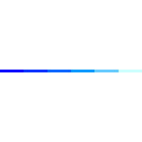

<!-- =====================================================================
README por @Cryptoverso — 
Org: Coin-Nodes → https://github.com/Coin-Nodes
https://github.com/Cryptoverso?tab=overview&from=2025-08-01&to=2025-08-18
===================================================================== -->

<!-- ========== HERO / HEADER ========== -->
<picture>
  <source media="(prefers-color-scheme: dark)" srcset="https://capsule-render.vercel.app/api?type=waving&height=180&color=0:00D4FF,50:7C3AED,100:00D4FF&text=Cryptoverso&fontColor=FFFFFF&fontSize=44&animation=fadeIn&section=header&desc=Fintech%20%7C%20Cryptoassets%20%7C%20Market%20Maker%20%7C%20Founder%20%40%20Coin%20Nodes">
  
</picture>

  
  
  <!-- Quick badges -->
  
  
  

---

## 👋 Sobre
Profissional de **Mercado Financeiro** e **Tecnologia** há 7+ anos. Comecei aos 16 anos como operador e dev; passei por **fundos** e **fintechs**; hoje lidero a [**Coin Nodes Org**](https://github.com/Coin-Nodes), entregando **soluções sob medida** para qualquer empresa que precise de um parceiro de tecnológico. Somos especialistas em tecnologia financeiro  porém fazemos de tudo. Hoje, já entregamos mais de 30 Grandes Projetos e dentro deles mais de 10 bancos e financeiras.

Coin Nodes LTDA é a Software House que sua empresa precisa para desenrolar qualquer produto. Entregamos exatamente o que você idealizar, com tecnologia de ponta , infraestrutura e IA integrada.

---

## 🚀 O que entregamos
<!-- Prioriza tecnologia/softwares primeiro, conforme solicitado -->
- **Software on-demand para sua empresa**
- **Soluções de IA**
- **Plataforma Web, Aplicativos iOS e Android**
- **Especialistas em bancos, financeiras e plataformas de investimentos**

**E outros produtos nossos:**
- 💳 **Pagamentos cripto ↔ fiat** para **fundos e operadores** (on/off ramp, conciliação).
- 🏦 **OTC & Exchange Desk** (FX/BRL, multi-venues, políticas de risco, routing).
- 🤖 **Market-Maker Bots** (hedge, inventory, TWAP/VWAP, baixa latência).
- 🧱 **Tokenização** de **ativos e bens** (emissão, lifecycle, governança).
- 🛠️ **Software on-demand** (APIs, microsserviços, KYC/KYT, auditoria).

> **Stack:** cloud-native (**Kubernetes-first**), IaC com **Terraform**, observabilidade e **SRE mindset**.

---

## 🧰 Stack

  <table>
    <tr>
      <td align="center" width="96">
         Golang
      </td>
      <td align="center" width="96">
         Python
      </td>
      <td align="center" width="96">
         Rust
      </td>
      <td align="center" width="96">
         Node.js
      </td>
      <td align="center" width="96">
         React
      </td>
      <td align="center" width="96">
         K8s
      </td>
      <td align="center" width="96">
         Terraform
      </td>
      <td align="center" width="96">
         Git
      </td>
    </tr>
  </table>

---

## 🤝 Contato

  
  &nbsp;&nbsp;
  
  &nbsp;&nbsp;
  
  &nbsp;&nbsp;
  
    
  <a href="https://github.com/Coin-Nodes" target="_blank"><b>➡️ Conheça a Coin Nodes Org</b></a>
   
  

---

<!-- Se você já tem ./waves.gif no repo, mantenha. Caso não, comente/ajuste. -->

  

  Built with ❤️ por Cryptoverso • Engenharia para operações que não podem parar.

